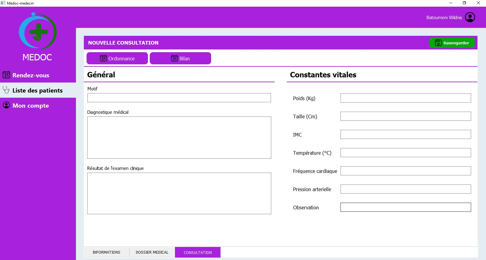
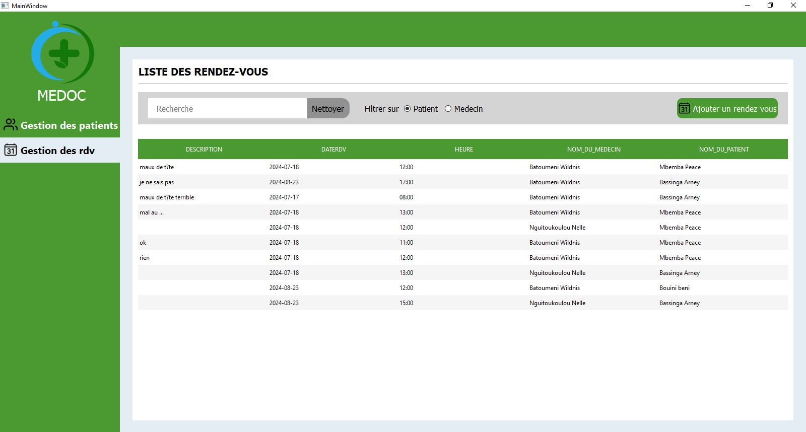
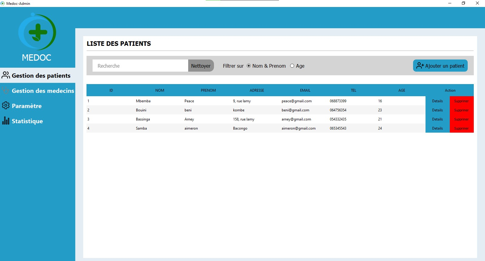

# 💊 Medoc – Gestion des consultations médicales

Ce projet est une solution logicielle C++/Qt pour la gestion des consultations médicales dans un établissement de santé. Il est conçu autour de la programmation orientée objet (POO) et utilise **Oracle 11g** comme système de gestion de base de données.

## 🗂️ Structure du projet

Le projet est divisé en 4 applications indépendantes, chacune dans un dossier dédié :

- `medocAdmin` : application pour l’administrateur
- `medocMedecin` : application pour le médecin
- `medocReception` : application pour le réceptionniste
- `medocPatient` : application pour le patient

Chaque application est indépendante et utilise sa propre instance de la base de données (aucune liaison entre établissements).

---

## 🛠️ Prérequis

Avant d'exécuter le projet :

1. **Oracle Database 11g** doit être installé.
2. Configurer **Oracle Instant Client** avec Qt Creator.
3. Copier le fichier `libMysql.lib` (présent à la racine du projet) vers :
   ```
   C:\Windows
   ```

---

## 📦 Installation

1. **Exécutez le script SQL de création de la base de données** :

   Le fichier `base.sql` se trouve à la racine du projet. Importez-le dans Oracle pour créer les tables et les données nécessaires.

2. **Configurez les identifiants de connexion à la base de données** :

   Dans chaque dossier (`medocAdmin`, `medocMedecin`, `medocReception`, `medocPatient`), ouvrez le fichier suivant :

   ```
   connexion/databaseManager.cpp
   ```

   Modifiez les informations suivantes avec votre nom d'utilisateur Oracle et votre mot de passe :
   ```cpp
   db.setUserName("votre_nom_utilisateur");
   db.setPassword("votre_mot_de_passe");
   ```

3. **Compilez et exécutez l'application** via Qt Creator.

---

## 🏁 Lancement

Ouvrez l’un des projets (`.pro`) dans Qt Creator, compilez-le, puis exécutez. Répétez l’opération pour chaque application.

---

## 📌 Remarques

- Ce projet est destiné à être déployé dans plusieurs établissements. Chaque installation aura sa propre base de données Oracle.
- Il n’y a aucune interconnexion entre les établissements.
- Toute la logique est fondée sur la POO pour une bonne extensibilité et maintenabilité.

---

## Images du logiciel






